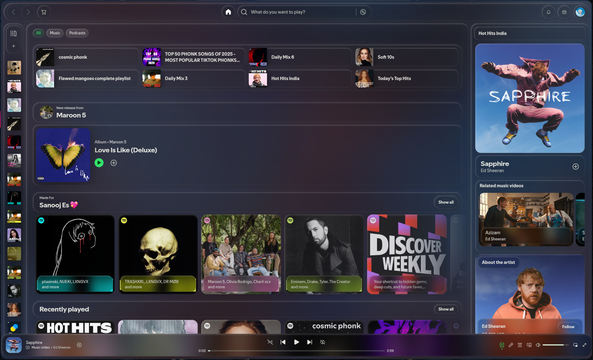
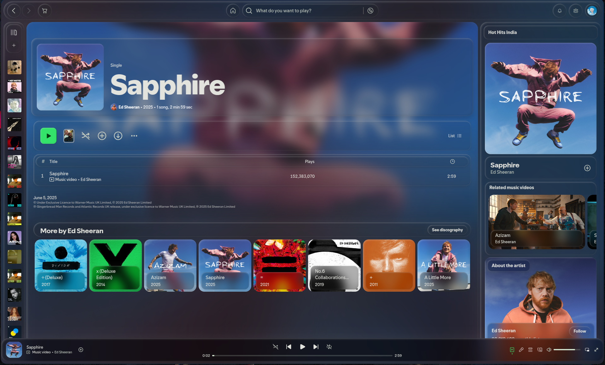

# Glassify Theme

- Glassify is a fluid, glass-like Spicetify theme for Spotify, designed to give your music player a modern, translucent interface with smooth visuals and fully customizable elements. Experience Spotify like never before with an elegant, immersive design.

---

## 🖥️ Preview

<div style="display: flex; flex-wrap: wrap; justify-content: center; gap: 0.5rem">
  
  
</div>

<details>
  <summary>Lazy note</summary>
  Sorry, am lazy to add more previews. Try out the theme.
</details>

---

## ✅ Compatibility

- **Recommended Spicetify**: `v2.40.11` or later
- **Recommended Spotify**: `v1.2.63` or later

## 📦 Older Versions

If you want previous releases, you can find them here:
[Older Releases](https://sanooj.is-a.dev/spicetify-glassify/versions/)

> Each release contains full theme files.

---

## 💬 Community & Support

- 🗨️ [Discord (Lucid Theme Server)](https://discord.gg/PWEyKduwJh) – _I’m lazy to create a separate Spicetify server_
- 🐛 [GitHub Issues](https://github.com/sanoojes/Spicetify-Glassify/issues)

---

## 📥 Installation

### 🔸 Spicetify Marketplace (Recommended)

1. [Install Marketplace](https://github.com/spicetify/marketplace/wiki/Installation)
2. Search **"Lucid"** and click **Install**

---

### 🔹 Script Installation

#### Windows (PowerShell)

**Latest version:**

```powershell
[Net.ServicePointManager]::SecurityProtocol = [Net.SecurityProtocolType]::Tls12
iex "& { $(iwr -useb 'https://cdn.jsdelivr.net/gh/sanoojes/Spicetify-Glassify@latest/scripts/install.ps1') }"
```

**Specific release/tag:**

```powershell
$tag = "v1.2.3"  # Replace with desired release tag
[Net.ServicePointManager]::SecurityProtocol = [Net.SecurityProtocolType]::Tls12
iex "& { $(iwr -useb "https://cdn.jsdelivr.net/gh/sanoojes/Spicetify-Glassify@$tag/scripts/install.ps1") }"
```

#### Linux/macOS (Bash)

**Latest version:**

```bash
curl -fsSL https://cdn.jsdelivr.net/gh/sanoojes/Spicetify-Glassify/scripts/install.sh | sh
```

**Specific release/tag:**

```bash
TAG="v1.2.3"  # Replace with desired release tag
curl -fsSL https://cdn.jsdelivr.net/gh/sanoojes/Spicetify-Glassify@$TAG/scripts/install.sh | sh
```

---

### 🔸 Manual Installation

1. [Download ZIP](https://github.com/sanoojes/Spicetify-Glassify)

   - For older releases, go to [Releases](https://github.com/sanoojes/Spicetify-Glassify/releases)

2. Find your Spicetify themes folder:

```bash
spicetify path userdata
```

3. Create a `Lucid` folder inside `Themes`
4. Extract contents of `/src` (or `/releases/<tag>` for a specific version) into `Lucid`
5. Apply the theme:

```bash
spicetify config current_theme Lucid
spicetify config color_scheme dark
spicetify config inject_css 1 replace_colors 1 overwrite_assets 1 inject_theme_js 1
spicetify apply
```

---

## ❌ Uninstallation

### Windows (PowerShell)

```powershell
[Net.ServicePointManager]::SecurityProtocol = [Net.SecurityProtocolType]::Tls12
iex "& { $(iwr -useb 'https://cdn.jsdelivr.net/gh/sanoojes/Spicetify-Glassify@latest/scripts/uninstall.ps1') }"
```

### Linux/macOS (Bash)

```bash
curl -fsSL https://cdn.jsdelivr.net/gh/sanoojes/Spicetify-Glassify/scripts/uninstall.sh | sh
```

---

## 📄 License

[MIT License](LICENSE)
